# Monitoring Kubernetes Project: Observability with Prometheus & Grafana

A hands-on demonstration of building a complete Kubernetes monitoring stack using **Prometheus**, **Node Exporter**, and **Kube-State-Metrics** on a **Minikube cluster**.

---

## Infrastructure Overview

| Component | Resource Name |
| :--- | :--- |
| **Kubernetes Cluster** | `Minikube` |
| **Monitoring Namespace** | `monitoring` |
| **Prometheus Stack** | `kube-prometheus-stack` |
| **Helm Repository** | `prometheus-community` |
| **Metrics Agent (Nodes)** | `Node Exporter` |
| **Cluster Metrics** | `Kube-State-Metrics` |

---

## Deploy Prometheus for Metrics Collection

### 1. Cluster Initialization
* Created and started a local Kubernetes cluster using Minikube.
* Created a dedicated namespace for monitoring workloads.

```bash
minikube start
kubectl create namespace monitoring
```
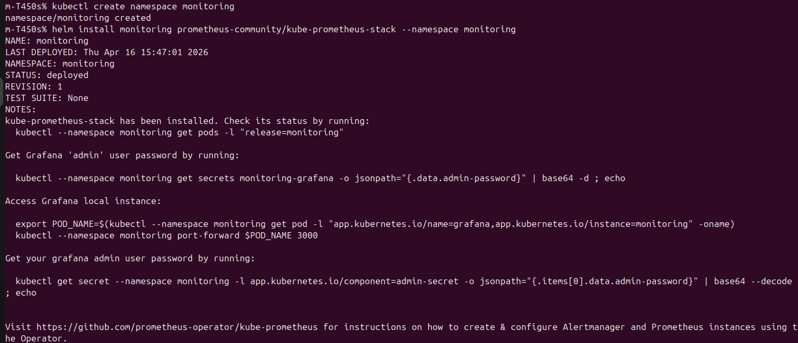
### 2.Prometheus on Kubernetes (EKS) using Helm
* Added Prometheus Helm repository and updated Helm charts.

```bash
helm repo add prometheus-community https://prometheus-community.github.io/helm-charts
helm repo update
```
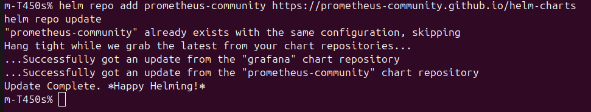
### 3.Installed Prometheus, Node Exporter, Kube-State-Metrics, Alertmanager, and Grafana using Helm
* Installed the full monitoring stack using Helm.
```bash
helm install monitoring prometheus-community/kube-prometheus-stack \
  --namespace monitoring
```
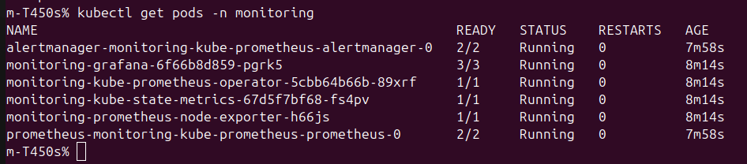
## Set up Grafana for Data Visualization
### 1. Grafana Access & Configuration
* Grafana was deployed automatically as part of the kube-prometheus-stack.
* Accessed Grafana locally using port-forwarding.

```bash
kubectl port-forward svc/monitoring-grafana -n monitoring 3000:3000
```
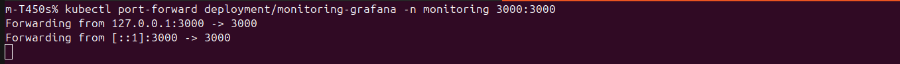
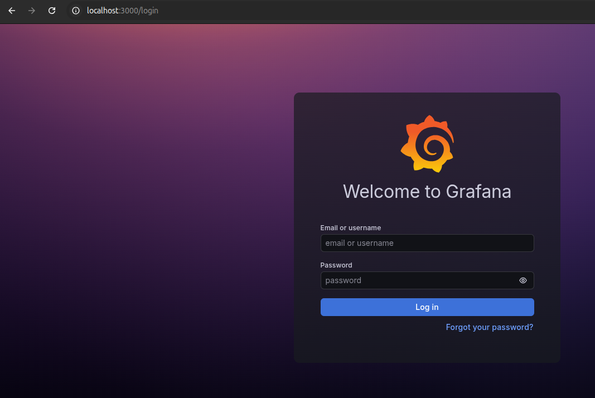
* Password: retrieved via Kubernetes secret
```bash
kubectl get secret --namespace monitoring monitoring-grafana \
  -o jsonpath="{.data.admin-password}" | base64 --decode
```
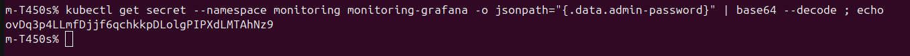

### 2. Custom Dashboards Creation
* Cluster Health Dashboard
* This dashboard provides an overview of the overall state of the Kubernetes cluster.
---

| Metric | Description |
| :--- | :--- |
| **CPU Usage** | `Total CPU consumption across the cluster` |
| **Memory Usage** | `Total memory usage across all containers` |
| **Running Pods** | `Number of active pods in Running state` |

---
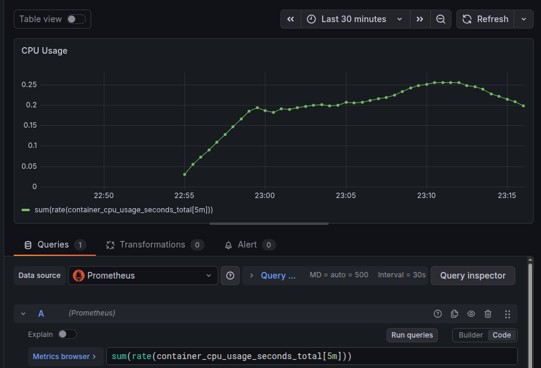
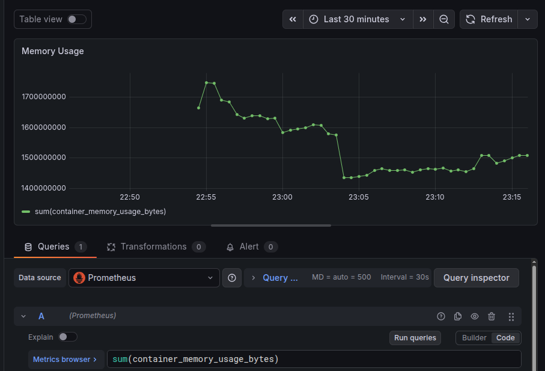
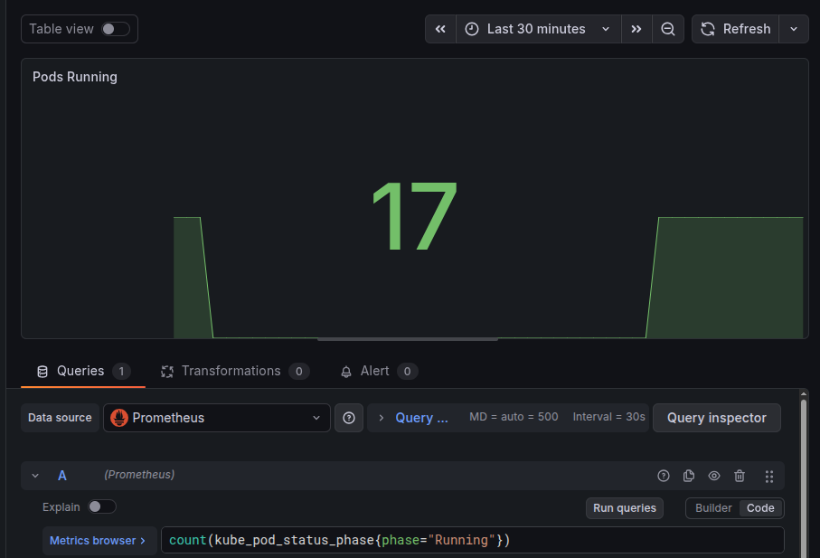

* Storage Monitoring
* This panel tracks disk utilization across nodes.
---

| Metric | Description |
| :--- | :--- |
| **Disk Usage** | `Percentage of used storage capacity` |

---
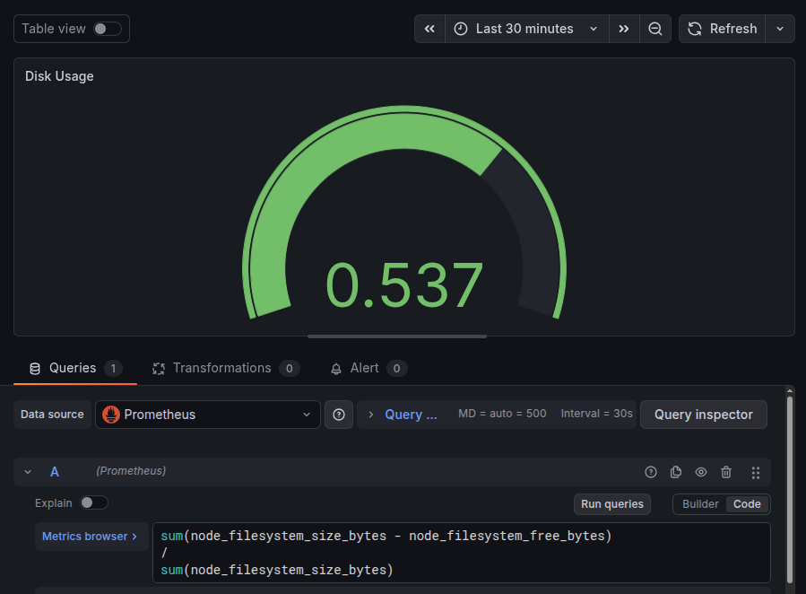

### 3. Visualization Choices

Different panel types were selected based on the nature of the data:

* Time Series
Used for CPU and memory metrics to show trends over time.
* Stat Panel
Used for displaying real-time values such as running pods.
* Gauge
Used for storage utilization to represent percentage-based capacity.
## Configure PromQL Queries for Analysis

### 1.Key Performance Indicators (KPIs)
* 1.*CPU Usage
```bash 
sum(rate(container_cpu_usage_seconds_total[5m]))
```
* 2.Memory Usage
```bash 
sum(container_memory_usage_bytes)
```
* 3.Running Pods
```bash
count(kube_pod_status_phase{phase="Running"})
```

### 2.PromQL Optimization Techniques
* rate() :Used for counter metrics (CPU, requests)
```bash
rate(container_cpu_usage_seconds_total[5m])
```
* avg_over_time(): Smooths fluctuations:
```bash
avg_over_time(container_memory_usage_bytes[10m])
```
### 3.SQL vs PromQL Comparison
## SQL vs PromQL Comparison
---

| Concept | PromQL | SQL Equivalent |
| :--- | :--- | :--- |
| Filtering | `{pod="x"}` | WHERE pod='x' |
| Aggregation | `sum()` | SUM() |
| Grouping | `by (pod)` | GROUP BY pod |
| Time Window | `[5m]` | INTERVAL 5 MIN |
| Rate Calculation | `rate()` | Window functions |

---

## Implement Alerting with Prometheus & Alertmanager

### 1. Alert Rules Definition

Custom alert rules were created using PromQL to monitor critical conditions in the Kubernetes cluster.

The following alerts were implemented:

| Alert | Description |
| :--- | :--- |
| **High CPU Usage** | Triggered when CPU usage exceeds a defined threshold |
| **High Memory Usage** | Triggered when memory consumption is too high |
| **Pod Down** | Triggered when no running pods are detected |

Example alert rule configuration:

```yaml
apiVersion: monitoring.coreos.com/v1
kind: PrometheusRule
metadata:
  name: custom-alerts
  namespace: monitoring
spec:
  groups:
  - name: custom.rules
    rules:

    - alert: HighCPUUsage
      expr: sum(rate(container_cpu_usage_seconds_total[2m])) > 0.5
      for: 1m
      labels:
        severity: warning
      annotations:
        summary: "High CPU usage detected"

    - alert: HighMemoryUsage
      expr: sum(container_memory_usage_bytes) > 500000000
      for: 1m
      labels:
        severity: warning
      annotations:
        summary: "High memory usage detected"

    - alert: PodDown
      expr: count(kube_pod_status_phase{phase="Running"}) < 1
      for: 1m
      labels:
        severity: critical
      annotations:
        summary: "Pod is down"
```
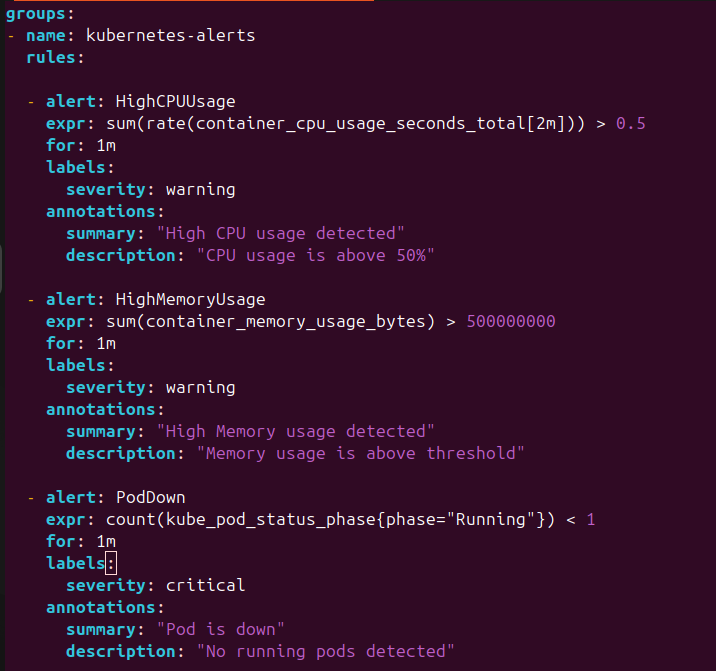
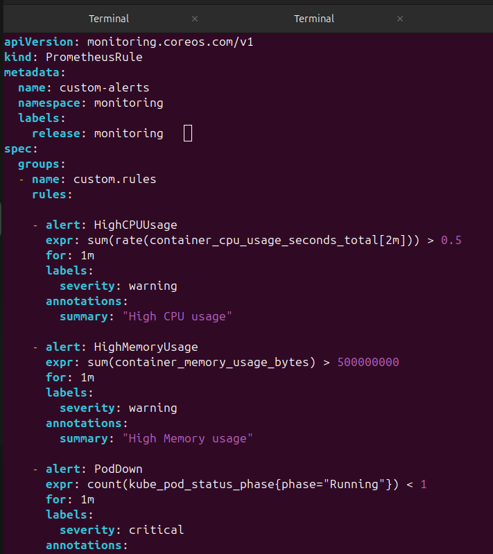
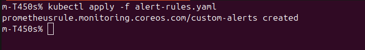


### 2. Alertmanager Configuration
Alertmanager is included in the kube-prometheus-stack and is responsible for handling alerts generated by Prometheus.

* Groups and manages alerts
* Displays alerts in a web interface
* Can be extended to send notifications (Slack, email, webhooks)

```bash
kubectl port-forward svc/monitoring-kube-prometheus-alertmanager -n monitoring 9093:9093
```
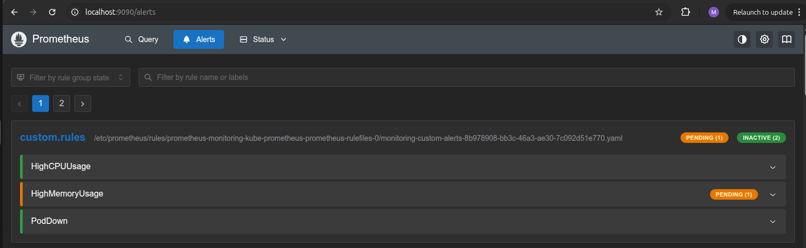

### 3. Testing Alerts
Alerts were tested by simulating real conditions inside the cluster.
* CPU Load Test: A stress container was used to generate high CPU usage
```bash
kubectl run stress --image=polinux/stress -- stress --cpu 2 --timeout 120
```
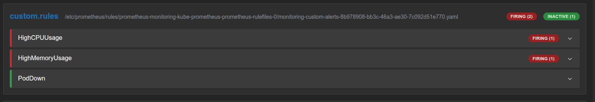
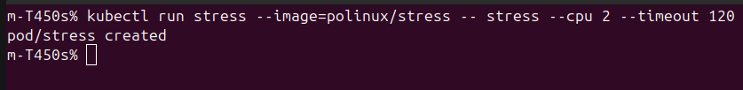


